# Deployment Documentation for StreamingApp

This document outlines the complete system architecture, configuration, and deployment process used to migrate the StreamingApp from a local development environment into a production-grade AWS Elastic Kubernetes Service (EKS) cluster.

## 1. System Architecture

*(Note: The following is a Mermaid diagram. If your Markdown viewer does not render Mermaid graphs, please view this file on GitHub or any Mermaid-compatible viewer).*

```mermaid
graph TD
    Client[User Browser] -->|HTTP| ELB[AWS Classic Load Balancer]
    ELB -->|NodePort 31265| Frontend[Frontend React SPA]
    
    subgraph EKS Cluster [Amazon EKS Cluster - ap-south-1]
        Frontend -->|ClusterIP 3001| Auth[Auth Service]
        Frontend -->|ClusterIP 3002| Streaming[Streaming Service]
        Frontend -->|ClusterIP 3003| Admin[Admin Service]
        Frontend -->|ClusterIP 3004| Chat[Chat Service]
        
        Auth -->|ClusterIP 27017| MongoDB[(MongoDB)]
        Streaming --> MongoDB
        Admin --> MongoDB
        Chat --> MongoDB
    end
    
    Jenkins[Jenkins CI/CD Server] -->|Build & Push| ECR[Amazon ECR]
    ECR -->|Pull Images| EKS Cluster
    EKS Cluster -->|Metrics & Logs| CloudWatch[AWS CloudWatch]
```

The overall architecture is designed using a microservices pattern. We have 5 distinct services:
- **Frontend**: A React Single Page Application that serves the user interface.
- **Auth Service**: Handles user registration, login, and JWT token issuance.
- **Streaming Service**: Manages video catalog and S3 video streaming.
- **Admin Service**: Handles backend administrative tasks like video uploads.
- **Chat Service**: Manages real-time WebSockets for watch parties.

These backend Node.js microservices communicate with a shared MongoDB database.

In our AWS deployment, we containerized all 5 services using Docker and pushed them to Amazon Elastic Container Registry (ECR). We then provisioned an Amazon EKS cluster with 2 worker nodes. The backend services and MongoDB are exposed internally inside the cluster using `ClusterIP` services. The React Frontend is exposed to the public internet using an AWS Classic `LoadBalancer`.

## 2. Docker Containerization and ECR Setup

First, we created 5 private repositories in Amazon ECR to host our Docker images.

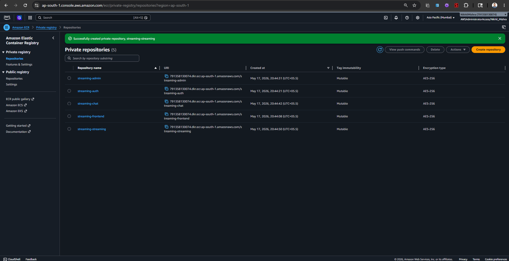

We successfully configured the AWS CLI on our local machine to authenticate with AWS and verified the connection.

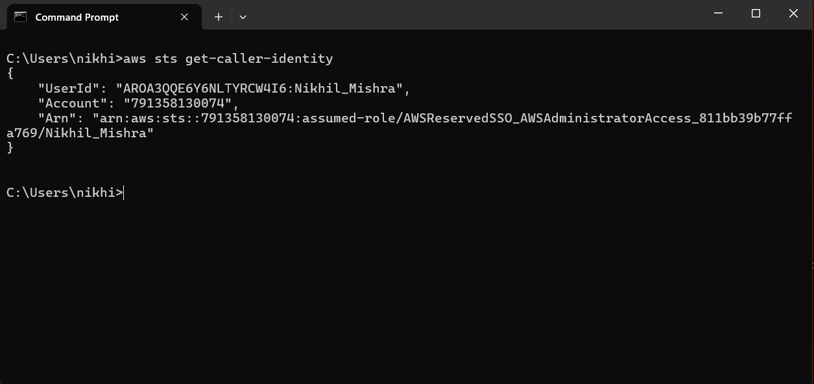

## 3. Jenkins CI/CD Pipeline

To automate the build and deployment process, we provisioned an Amazon EC2 instance and installed a self-managed Jenkins server. 

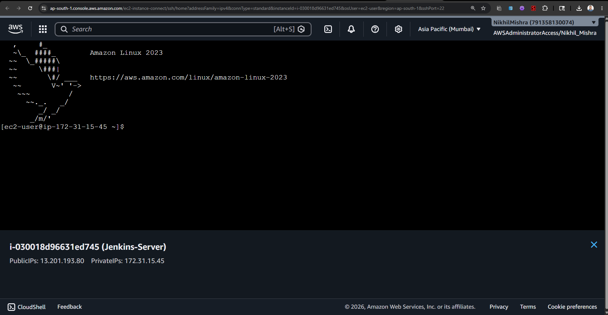
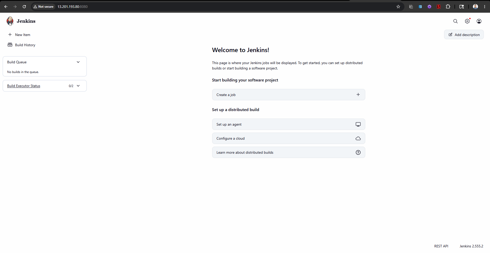

We created a declarative `Jenkinsfile` pipeline that automatically pulls our code from GitHub, logs into AWS ECR, and builds and pushes all 5 microservice images. During the frontend build, the pipeline injects relative API paths as build arguments so the React SPA routes all API traffic through the NGINX reverse proxy instead of hardcoding backend URLs.

Here is the pipeline we used:
```groovy
pipeline {
    agent any
    environment {
        AWS_ACCOUNT_ID = "791358130074"
        AWS_REGION = "ap-south-1"
        ECR_URI = "${AWS_ACCOUNT_ID}.dkr.ecr.${AWS_REGION}.amazonaws.com"
    }
    stages {
        stage('Checkout') {
            steps { checkout scm }
        }
        stage('AWS ECR Login') {
            steps {
                sh "aws ecr get-login-password --region ${AWS_REGION} | docker login --username AWS --password-stdin ${ECR_URI}"
            }
        }
        stage('Build & Push Frontend') {
            steps {
                sh '''
                    docker build \
                      --build-arg REACT_APP_AUTH_API_URL=/api/auth \
                      --build-arg REACT_APP_STREAMING_API_URL=/api/streaming \
                      --build-arg REACT_APP_ADMIN_API_URL=/api/admin \
                      --build-arg REACT_APP_CHAT_API_URL=/api/chat \
                      --build-arg REACT_APP_CHAT_SOCKET_URL=/ \
                      -t streaming-frontend ./frontend
                '''
                sh "docker tag streaming-frontend:latest ${ECR_URI}/streaming-frontend:latest"
                sh "docker push ${ECR_URI}/streaming-frontend:latest"
            }
        }
        stage('Build & Push Auth Service') {
            steps {
                sh "docker build -t streaming-auth ./backend/authService"
                sh "docker tag streaming-auth:latest ${ECR_URI}/streaming-auth:latest"
                sh "docker push ${ECR_URI}/streaming-auth:latest"
            }
        }
        stage('Build & Push Admin Service') {
            steps {
                sh "docker build -f ./backend/adminService/Dockerfile -t streaming-admin ./backend"
                sh "docker tag streaming-admin:latest ${ECR_URI}/streaming-admin:latest"
                sh "docker push ${ECR_URI}/streaming-admin:latest"
            }
        }
        stage('Build & Push Chat Service') {
            steps {
                sh "docker build -f ./backend/chatService/Dockerfile -t streaming-chat ./backend"
                sh "docker tag streaming-chat:latest ${ECR_URI}/streaming-chat:latest"
                sh "docker push ${ECR_URI}/streaming-chat:latest"
            }
        }
        stage('Build & Push Streaming Service') {
            steps {
                sh "docker build -f ./backend/streamingService/Dockerfile -t streaming-streaming ./backend"
                sh "docker tag streaming-streaming:latest ${ECR_URI}/streaming-streaming:latest"
                sh "docker push ${ECR_URI}/streaming-streaming:latest"
            }
        }
    }
}
```

When we triggered the pipeline, it successfully ran through all stages and pushed the images to ECR.

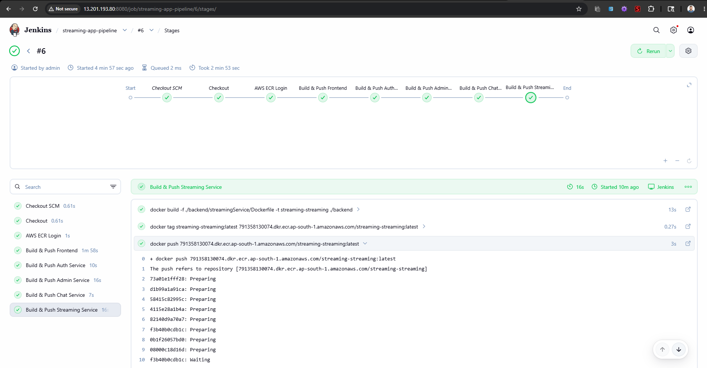
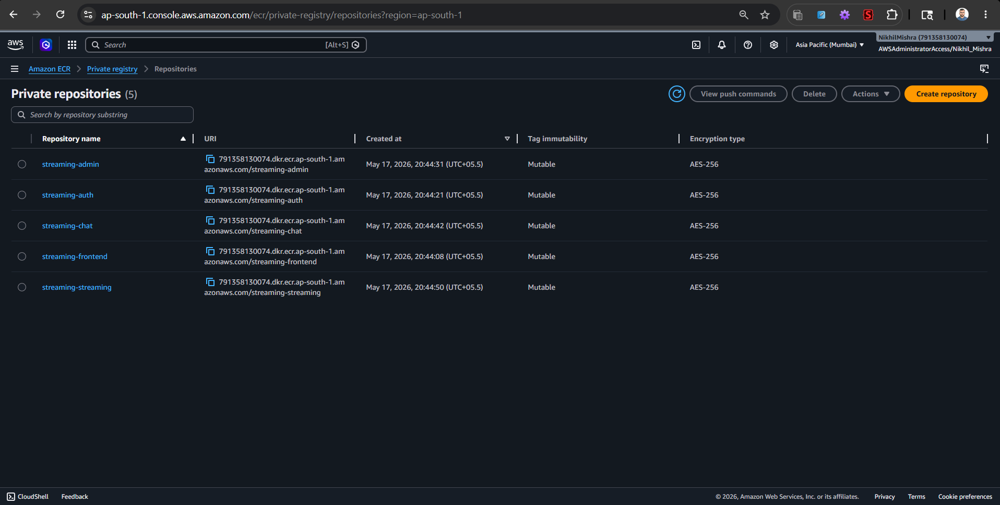

## 4. Kubernetes Orchestration on EKS

### Cluster Provisioning
We provisioned our Amazon EKS cluster (`streaming-cluster`) in the `ap-south-1` region using the `eksctl` CLI tool. It was configured to use a managed node group with 2 `t3.medium` instances.

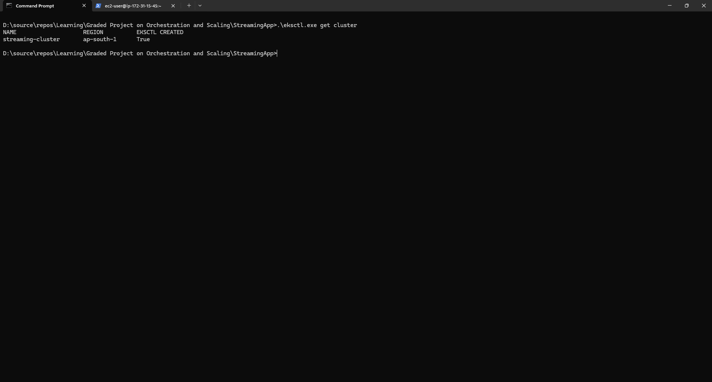

### Kubernetes Manifest Configuration
Instead of using individual YAML files, we created a unified `k8s-manifest.yaml` file containing all Deployments and Services. 

We explicitly injected the necessary environment variables directly into the Deployment specifications for the backend services. For example, we configured the `MONGO_URI` to point to the internal `mongo:27017` service, and injected the `JWT_SECRET`. We also configured the necessary container ports (3001, 3002, 3003, 3004).

We deployed the manifest using `kubectl apply -f k8s-manifest.yaml`. After the images were pulled, all 6 pods transitioned into a `Running` state successfully.

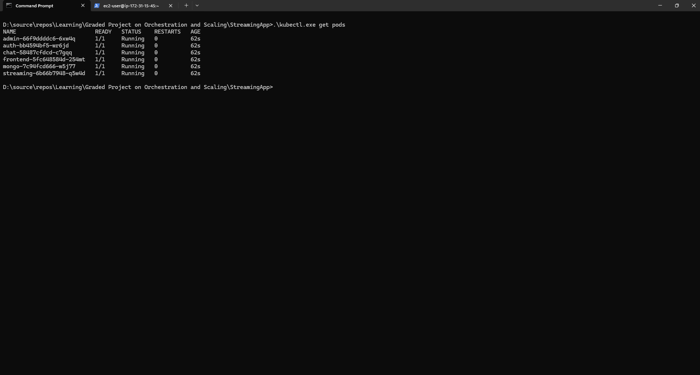

## 5. Monitoring and ChatOps

### AWS CloudWatch
To monitor the health of our cluster, we verified that the EC2 worker nodes were natively sending metrics (CPU/Network Utilization) to AWS CloudWatch.

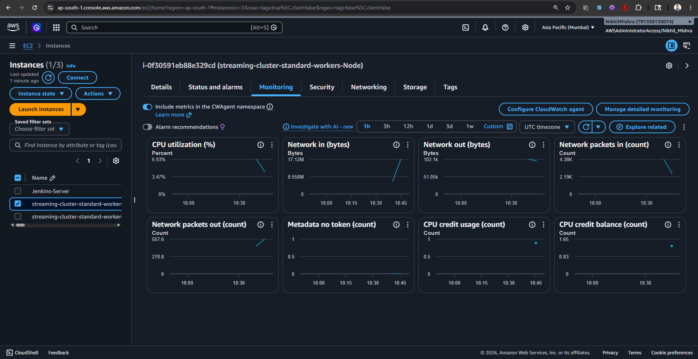

We also used `eksctl` to enable Control Plane Logging, routing all EKS cluster logs directly to CloudWatch Log Groups.

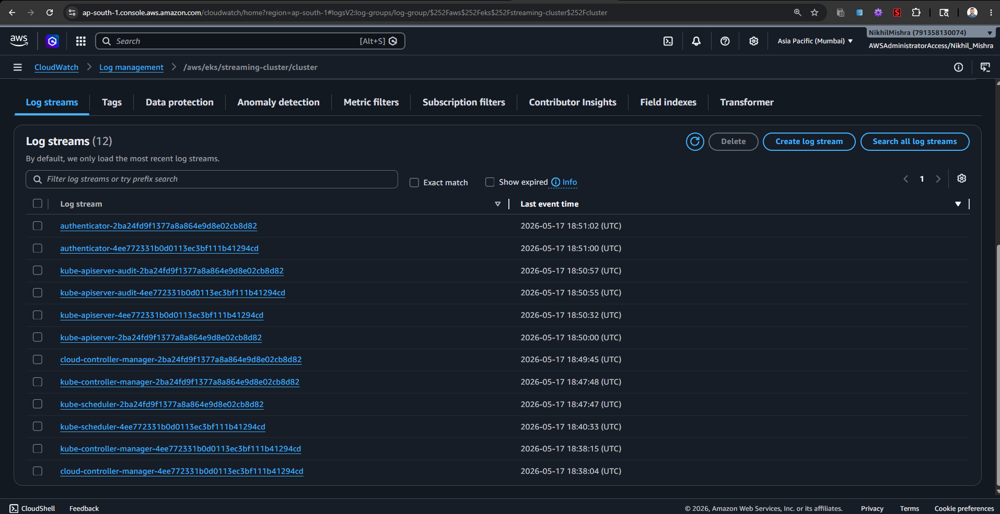

### Amazon SNS Notification
For ChatOps integration, we created an Amazon SNS topic called `streaming-cluster-alerts` using the AWS CLI. We then subscribed an email address to this topic to receive critical pipeline and cluster events, and confirmed the subscription.

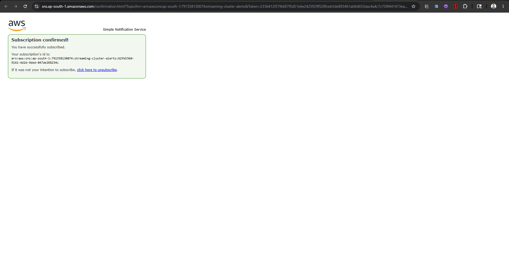

To validate the integration, we published a test alert message to the SNS topic and successfully received the automated notification via email, proving the pipeline/cluster alerting is fully operational.

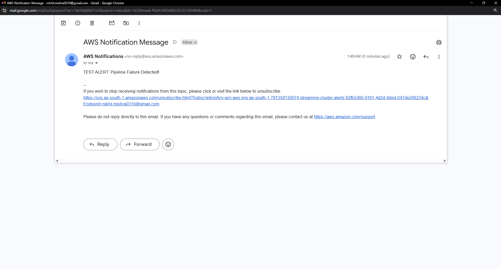

## 6. Final Validation of Frontend and Backend

To validate the deployment, we needed to verify that both the frontend and backend are functional and accessible.

To ensure the application was entirely cloud-native and secure, we configured the Frontend's NGINX server as a reverse proxy. This allowed the React SPA to seamlessly route backend API calls internally through the Kubernetes network without exposing backend ports publicly.

We accessed the React Frontend via the public AWS Classic Load Balancer URL, proving the frontend was loading correctly from the cloud.

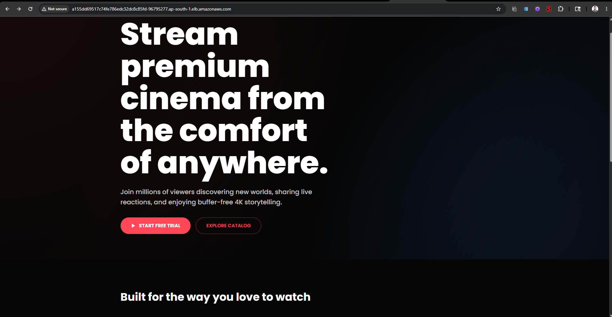

We then registered a new user account, logged in, and successfully loaded the streaming video catalog. This explicitly proved that the Frontend, Auth Service, Streaming Service, and MongoDB were communicating perfectly end-to-end.

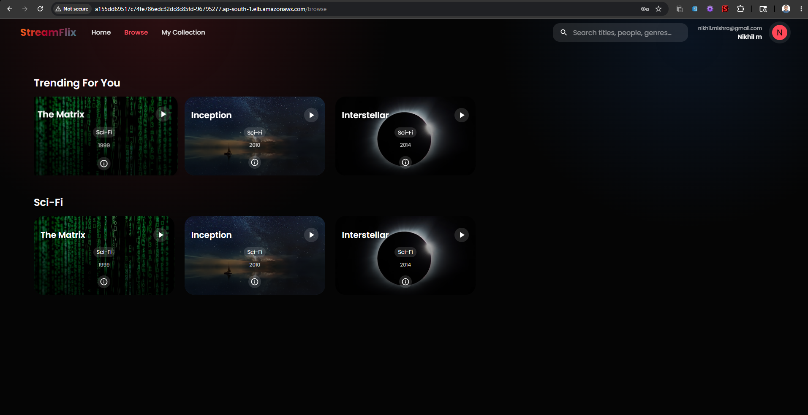

To directly validate the backend microservices, we ran a `validate.bat` script that uses `kubectl port-forward` to securely tunnel traffic from the Kubernetes cluster to our local machine for all 4 backend services simultaneously. We then verified each service's health endpoint to confirm they were up, running, and accessible:

- **Auth Service Validation (Port 3001)**: `http://localhost:3001/health`
  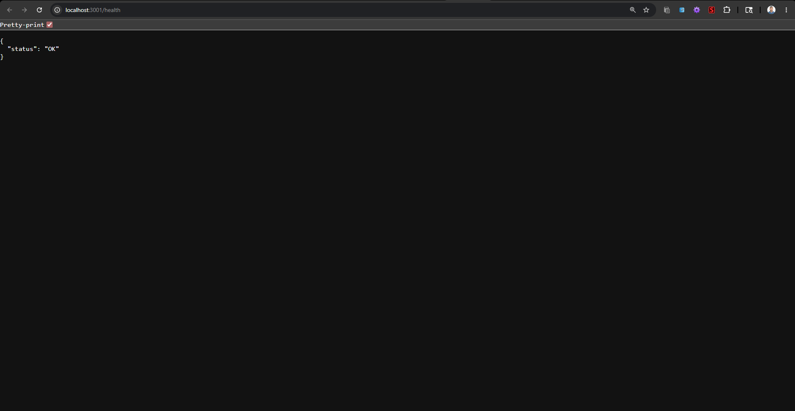
- **Streaming Service Validation (Port 3002)**: `http://localhost:3002/api/health`
  
- **Admin Service Validation (Port 3003)**: `http://localhost:3003/api/health`
  
- **Chat Service Validation (Port 3004)**: `http://localhost:3004/api/health`
  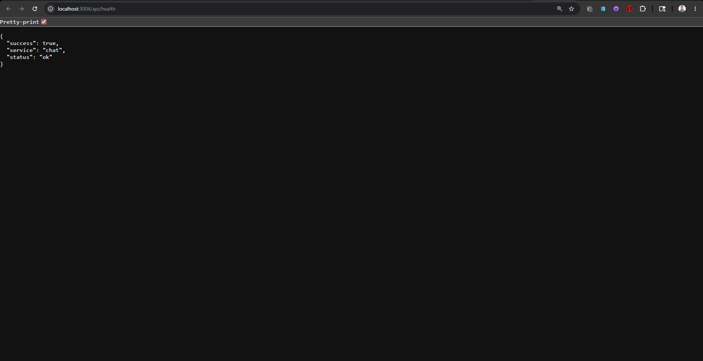

Both the frontend and the entire backend microservice architecture were successfully deployed, orchestrated, and completely validated.
